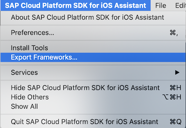
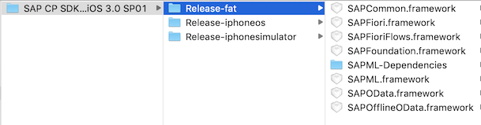
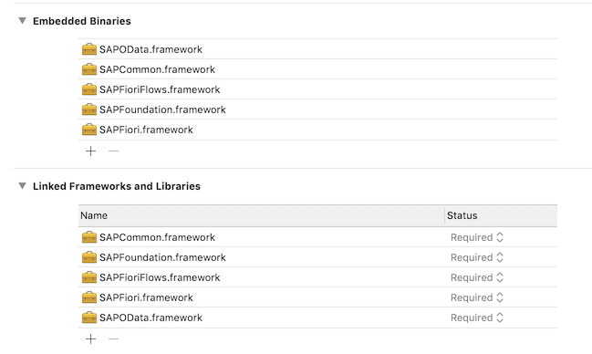

# SAP Cloud Platform SDK for iOS - Sample Apps
This repository hosts a collection of SAP Cloud Platform SDK for iOS sample apps demonstrating various components and features of the SDK in the context of bigger apps.

Each sample app sits in a separate folder of this repository and is fully self-contained.

| App      | Description |
| ----------- | ----------- |
| [Maps Bikes](maps-bikes)  | Illustrates a broad range of Maps features using a bike rental example |
| [OCR AAA Card Scan](ocr-AAACardScan)   | Shows how to configure the OCR capabilities to read structured, known content |
| [Swift Observations](swift-observations)  | Explains some details on how to avoid memory leaks with Swift Observations |

# Requirements
Any iOS development requires using a Mac and the development tools from Apple.
You need to have the current version of [Xcode](https://developer.apple.com/xcode/) installed.

# Download and Installation
All apps depend on the SAP Cloud Platform SDK for iOS frameworks that can be downloaded from the [SAP Community](https://www.sap.com/developer/trials-downloads/additional-downloads/sap-cloud-platform-sdk-for-ios-14485.html).

1. Open the Assistant and export the frameworks to your disk

2. You have this structure now. Use the 'fat' frameworks for local testing on device and simulator.

3. Open the Xcode build settings of the sample app project and add the required frameworks using the '+' button.

Some apps may require further configuration steps and have more dependencies that are listed in the respective readme files of each app.

# How to obtain support
If you have questions or feedback, please visit the [SAP Community Forum](https://answers.sap.com/tags/73554900100800000743) on the SAP Cloud Platform SDK for iOS.
Of course we also welcome PRs with suggestions and code improvements on our apps as well.

You can find more tutorials etc. in our [SAP Community for SDK for iOS](https://developers.sap.com/topics/cloud-platform-sdk-for-ios.html).

# Contributing
We're happy to publish sample projects that illustrate one or more capabilities of the SDK for iOS. 
Most of these projects would stem from testing and development and might have some legacy before showing up here.
Please make sure to apply some basic hygiene before publishing them:
* Have a readme that gives an overview of the project and highlights the crucial points
* No license statement in the app project itself, the license is at the top level of this repository
* No SAP Team ID in the project settings – just have ‘None’ in there
* No internal server references, e.g. github.wdf.sap.corp
* No `xcuserdata` content
* No frameworks/libraries included, if they are not pulled in automatically via Carthage, Cocoapods etc. please include instructions
* No references to any D#/I# numbers
* Include the required SAP CP SDK for iOS version in prerequisites
* Use SAP header in all files
* Naming convention for the top-level folder: `<SDK feature>-<project name>`

# License
Copyright (c) 2019 SAP SE or an SAP affiliate company. 
All rights reserved.

This project including all sample apps in the subfolders are licensed under the SAP Sample Code License except as noted otherwise in the [LICENSE](LICENSE) file.
