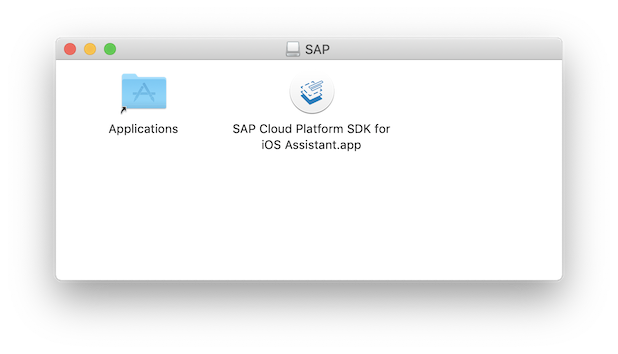

# Important Notice
This public repository is read-only and no longer maintained.

# SAP Cloud Platform SDK for iOS - Sample Apps

## Description
This repository hosts a collection of *SAP Cloud Platform SDK for iOS* sample apps demonstrating various components and features of the SDK in the context of bigger apps.

The [SAP Cloud Platform SDK for iOS](https://help.sap.com/viewer/p/SAP_CLOUD_PLATFORM_SDK_FOR_IOS) is based on the Apple Swift programming language, which emphasizes developer efficiency and ease of use when developing apps in the Xcode IDE. 
It supplements the Swift SDK, and does not replace it. 
Developers can use components of each, depending on the needs of a particular application.
The SDK for iOS includes well-defined layers (SDK frameworks, components, and platform services) that greatly simplify development of enterprise-ready mobile native iOS apps that take full advantage of iPhone and iPad features (Face ID, location services and notifications, and so on). 
It is tightly integrated with [SAP Cloud Platform Mobile Services](https://help.sap.com/viewer/p/SAP_CLOUD_PLATFORM_MOBILE_SERVICES).

Each sample app sits in a separate folder of this repository and is fully self-contained.

| App                                       | Description                                                                |
| ----------------------------------------- | -------------------------------------------------------------------------- |
| [Maps Bikes](maps-bikes)                  | Illustrates a broad range of Maps features using a bike rental example |
| [OCR AAA Card Scan](ocr-AAACardScan)      | Shows how to configure the OCR capabilities to read structured, known content |
| [Swift Observations](swift-observations)  | Explains some details on how to avoid memory leaks with Swift Observations |
| [Multi User](flows-multiuser)             | A sample application for multi-user support in a single app |

## Requirements
- Any iOS development requires using a Mac and the development tools from Apple.
You need to have the current version of [Xcode](https://developer.apple.com/xcode/) installed.

- All apps depend on the SAP Cloud Platform SDK for iOS frameworks that can be downloaded from the [SAP Community](https://www.sap.com/developer/trials-downloads/additional-downloads/sap-cloud-platform-sdk-for-ios-14485.html).

- Some apps require an SAP Cloud Platform Mobile Services account.
You can register for a [trial](https://account.hanatrial.ondemand.com/#/home/welcome), if you do not have a production account already.

Please refer to the specific sample app requirements for exact version requirements.
Typically, the *latest* version is what you need.

## Download and Installation
Simply clone the whole sample repository ([GitHub help on cloning](https://help.github.com/en/articles/cloning-a-repository)) and then use the respective sample app projects in the various directories.

1. After the initial download of the SDK, open the downloaded DMG file and simply drag&drop the *SAP Cloud Platform SDK for iOS Assistant* app into your *Applications* directory.

    

2. Open the *SAP Cloud Platform SDK for iOS Assistant* app and export the frameworks to your disk

    

3. You have this structure now. Use the frameworks in the `Release-fat` directory for local testing on device and simulator when configuring the project in Xcode.

    

## Configuration
Open the Xcode build settings of the sample app project and add the required frameworks (see exact list in the readme of the respective sample app) using the '+' button to the *Embedded Binaries* as well as the *Linked Frameworks and Libraries* sections.

Some apps may require further configuration steps and have more dependencies that are listed in the readme files of each app.

## Known Issues
We are not aware of general problems. 
If any sample comes with limitations or cases not considered in the sample, they are listed in the sample app readme itself.

In case you cannot compile the sample projects and see errors like `Module compiled with Swift 4.2.1 cannot be imported by the Swift 5.0 compiler` you are using incompatible versions of Xcode and the SDK for iOS. 
Please check the requirements on the SDK download page again - we list the exact version of Xcode required to be used with each SDK version there.

## How to obtain support
In case you found a bug or have any problems when trying to build and run the samples, please create an issue on this repository.
Use the existing labels to classify your problem and help us giving you the best possible support.

If you have general questions or feedback on any of the used SDK components, please visit the [SAP Community Forum](https://answers.sap.com/tags/73554900100800000743) on the SAP Cloud Platform SDK for iOS.

You can find more tutorials etc. in our [SAP Community for SDK for iOS](https://developers.sap.com/topics/cloud-platform-sdk-for-ios.html).

## Contributing
We're happy to publish sample projects that illustrate one or more capabilities of the SDK for iOS. 
Most of these projects would stem from testing and development and might have some legacy before showing up here.
Please make sure to apply some basic hygiene before publishing them:
* Have a readme that gives an overview of the project and highlights the crucial points
* No license statement in the app project itself, the license is at the top level of this repository
* No SAP Team ID in the project settings – just have ‘None’ in there
* No internal server references, e.g. github.wdf.sap.corp
* No `xcuserdata` content
* No frameworks/libraries included, if they are not pulled in automatically via Carthage, Cocoapods etc. please include instructions
* No references to any D#/I# numbers
* Include the required SAP CP SDK for iOS version in prerequisites
* Use SAP header in all files
* Naming convention for the top-level folder: `<SDK feature>-<project name>`

Of course we also welcome GitHub pull requests with suggestions and code improvements on our existing set of apps as well.

## License
Copyright (c) 2019 SAP SE or an SAP affiliate company. 
All rights reserved.

This project including all sample apps in the subfolders are licensed under the SAP Sample Code License except as noted otherwise in the [LICENSE](LICENSE) file.
