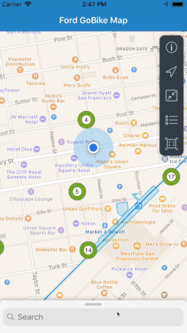
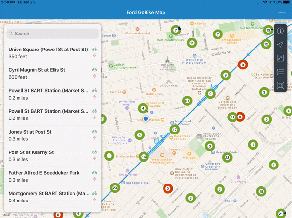
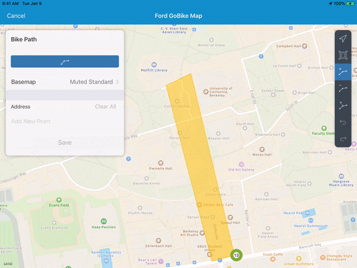

# SAPFioriBikes using SAP Cloud Platform SDK for iOS

This project showcases some of the [Map Floorplan](https://experience.sap.com/fiori-design-ios/article/map/) features of the 3.1 release of the [SAP Fiori iOS SDK](https://developer.apple.com/sap/).  Inspired by Apple's [TANDm](https://developer.apple.com/documentation/mapkit/mkannotationview/decluttering_a_map_with_mapkit_annotation_clustering) application from WWDC 2017 and the installation of [Ford GoBike](https://www.fordgobike.com/) across the bay area, `SAPFioriBikes` clusters bike stations and shows the number of bikes and eBikes at each location using the SAPFiori Map Floorplan implementation. With this application I hope I can finally track down one of the [Ford GoBike Plus](https://www.fordgobike.com/plus)!

## SAPFioriBikes iPhone

## SAPFioriBikes iPad

## SAPFioriBikes Editing Geospatial Objects

## Getting Started

1. Download the [SAP Cloud Platform SDK for iOS](https://developers.sap.com/topics/cloud-platform-sdk-for-ios.html#details) to get necessary frameworks locally.

2. Clone the repository.

3. Add the `SAPFiori.framework` and `SAPCommon.framework` to the `Embedded Binaries` and `Linked Frameworks and Libraries`.

4. Install `StellarJay` using Carthage

5. Build and Run 🚴‍

6. Read my walkthrough and checkout the corresponding branch (post#)
      1. [SAPFioriBikes: Visualization of GoBike Stations Built with the SAP Cloud Platform SDK for iOS](https://blogs.sap.com/2019/01/31/sapfioribikes-visualization-of-gobike-stations-built-with-the-sap-ios-sdk/)
      2. [SAPFioriBikes: Searching and Displaying GoBike Stations with SAP CP SDK for iOS](https://blogs.sap.com/2019/01/31/sapfioribikes-searching-and-displaying-gobike-stations/)
      3. [SAPFioriBikes: Geospatial Objects with SAP CP SDK for iOS](https://blogs.sap.com/2019/01/31/sapfioribikes-geospatial-objects/)
      4. [SAPFioriBikes: Drawing Geospatial Items with SAP CP SDK for iOS](https://blogs.sap.com/2019/01/31/sapfioribikes-drawing-geospatial-items/)

### Prerequisites

* Xcode 10.0+
* SAPFiori
* SAPCommon
* StellarJay

## API References

* [SAPFiori Reference](https://help.sap.com/doc/978e4f6c968c4cc5a30f9d324aa4b1d7/3.0/en-US/Documents/Frameworks/SAPFiori/index.html)

## Built With

* [Ford GoBike System Data](https://www.fordgobike.com/system-data)
* [StellarJay](https://github.com/sstadelman/stellarjay)
* [Uber Common](https://github.com/uber-common/deck.gl-data/blob/master/website/bart.geo.json)

## Authors

* **Alex Takahashi** - *Initial work* - [alextakahashi](https://github.com/alextakahashi)

## Acknowledgments

* [TANDm](https://developer.apple.com/documentation/mapkit/mkannotationview/decluttering_a_map_with_mapkit_annotation_clustering) - Cluster Annotation Inspiration
* [README-Template](https://gist.github.com/PurpleBooth/109311bb0361f32d87a2)
