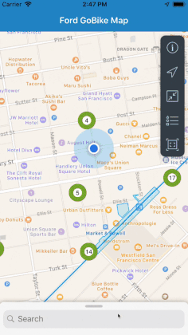

# SAPFioriBikes: Searching and Displaying GoBike Stations with SAP CP SDK for iOS

This project follows up with the original [SAPFioriBikes Blog](https://github.com/alextakahashi/SAPFioriBikes/tree/master) by configuring the Search Results View Controller and Content View Controller.



> Extending the SAPFioriBikes project with the MapFloorplan DetailPanel. Check out the code [HERE](https://github.com/alextakahashi/SAPFioriBikes/tree/post2)


## Finding the Closest Station

This app is most useful when you can easily find the closest station.  Acquiring device location allows us to sort and show the distance between the user and each station. Showing the user's location on an MKMapView is documented in the [SAPFiori Reference](https://help.sap.com/doc/978e4f6c968c4cc5a30f9d324aa4b1d7/Latest/en-US/Documents/Frameworks/SAPFiori/index.html).  Once the user location is displayed, we can use the [FUIMapToolbar.UserLocationButton](https://help.sap.com/doc/978e4f6c968c4cc5a30f9d324aa4b1d7/3.0/en-US/Documents/Frameworks/SAPFiori/Classes/FUIMapToolbar/UserLocationButton.html) to zoom and center on the annotation. The user location button is conveniently built in to the floorplan toolbar.


## Detail Panel Functionality

The [FUIMapDetailPanel](https://help.sap.com/doc/978e4f6c968c4cc5a30f9d324aa4b1d7/Latest/en-US/Documents/Frameworks/SAPFiori/Classes/FUIMapDetailPanel.html) is a controller similar to Apple Map's panel.


Our custom panel maintains the functionalities of Apple's panel, including displaying a minimum, intermediate, and maximum state.  Additionally, the internal tableView of the panels allow scrolling of its content.


The panel can show additional details by calling the `detailPanel.pushChildViewController()` method.  See `pushContent(_ : BikeStationAnnotation)` for an example implementation.

## Configuring the Search Results View Controller

If the user cannot conveniently see the closest station, they can swipe up on the panel to display the stations sorted by distance.


Configuration is performed during `viewDidLoad`

```swift
detailPanel.searchResults.tableView.register(FUIObjectTableViewCell.self, forCellReuseIdentifier: FUIObjectTableViewCell.reuseIdentifier)
detailPanel.searchResults.tableView.dataSource = searchResultsObject
detailPanel.searchResults.tableView.delegate = searchResultsObject
detailPanel.searchResults.searchBar.delegate = searchResultsObject
```
The developer adds their own implementation for the `tableView` and `searchBar`by implementing the `UITableViewDataSource`, `UITableViewDelegate`, and `UISearchBarDelegate`.  See the `SearchResultsControllerObject` for the implementation.  In this example, the stations are sorted by distance away from the user.  The bicycle and lightning icons show if there are bikes or EBikes at the designated station based on the color.

Now with the searchbar, it is possible to search for all the stations near BART!


## Configuring the Content View Controller


Similar to the Search Results, the Content View Controller is setup in `viewDidLoad`

```swift
detailPanel.content.tableView.dataSource = contentObject
detailPanel.content.headlineText = contentObject.headlineText
detailPanel.content.subheadlineText = contentObject.subheadlineText
```

Again, the developer is responsible for their own implementation of the `tableView`'s `UITableViewDataSource` and `UITableViewDelegate`.  Additionally, the Content View Controller has a `headlineText` and `subheadlineText` as the header of the tableView.  See the `ContentControllerObject` for the implementation.  More details are shown by showing tags with the number of bikes, EBikes, and docs available.  There is an additional button to launch the Ford GoBike App to reserve at this station.


To dismiss the content view controller, the user can tap the close button in the top right corner of the panel.

## iPad Support

The Detail Panel has similar functionality on the iPad, but takes advantage of extra screen size.


## Next Steps

In the next post I will extend this project to show other GeoSpatial objects including [`FUIPolyline`](https://help.sap.com/doc/978e4f6c968c4cc5a30f9d324aa4b1d7/3.0/en-US/Documents/Frameworks/SAPFiori/Map%20view.html#/s:8SAPFiori11FUIPolylineP) and [`FUIPolygon`](https://help.sap.com/doc/978e4f6c968c4cc5a30f9d324aa4b1d7/3.0/en-US/Documents/Frameworks/SAPFiori/Map%20view.html#/s:8SAPFiori10FUIPolygonP).

Read the next blog post [HERE](https://blogs.sap.com/2019/01/31/sapfioribikes-geospatial-objects/)

The completed project can be found [HERE](https://github.com/alextakahashi/SAPFioriBikes)

## Conclusion

The FUIMapDetailPanel provides a convenient way to search for stations and display additional details directly on top of the mapView similar to Apple Maps.  Developers simply need to set their own `UITableViewDataSource`, `UITableViewDelegate`, and `UISearchBarDelegate` to add their own custom implementation.  Despite the smaller screen sizes on the iPhone compared to the iPad, the DetailPanel can show scrollable content as needed.
