# SAPFioriBikes: Drawing Geospatial Items with SAP CP SDK for iOS

This project follows up with the original [SAPFioriBikes Blog Series](https://blogs.sap.com/2019/01/31/sapfioribikes-visualization-of-gobike-stations-built-with-the-sap-ios-sdk/) by drawing custom points, polylines, and polygons on the map. 

> Extending the SAPFioriBikes project by adding custom points, polylines, and polygons. Check out the code [HERE](https://github.com/alextakahashi/SAPFioriBikes/tree/post4)

 Through this walkthrough we also go over actions including:
* Adding points
* Deleting points
* Editing points
* Branching polylines
* Changing basemaps
* Adding points with suggestions
* Undo/Redo Editing actions
* Reordering points with drag and drop
* Location Snapshot View

## Drawing on the map

Drawing on the map allows users to document locations without the technical knowledge of adding them in code.  In this project, I draw polygons for walk zones and bike paths around the UC Berkeley campus using the floorplan's editing feature.  Currently drawing on the map is only supported on the iPad.  Although the SDK is designed for the enterprise use case such as a field worker monitoring an oil pipeline, this feature can be applied to the bikes example as well.  

### Walk Zone Polygons

Riding bikes is one of the main ways of commuting to classes around the UC Berkeley campus.  Due to high foot traffic, some locations on campus are designated walk zones for pedestrian safety.  The area between Sproul Hall and the Student Union serves as a central point on campus where many students eat, socialize, and study.

Below, I'll walk through how to draw the Walk Zone.

First, let's turn off the `Bikes Layer` and `Bart Layer` in the settings.  This will help declutter the map while we draw.

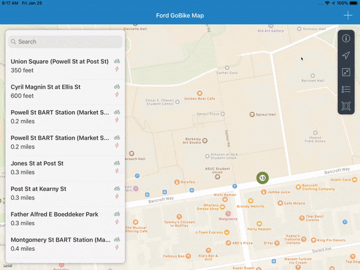

Tap the `+` button in the upper right corner to open the popover showing the items that can be created, `Walk Zone`, `Bike Path`, `Brewery`, and `Venue`.  Tap on the `Walk Zone` to begin creating this polygon.  

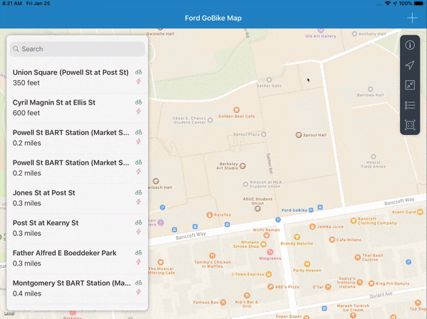

The editing panel appears on the left.  We will mark the perimeter of our walk zone between Sproul Hall and the ASUC Union from East to West and Sather Gate to Bancroft Way North to South.  Tap on the map to start adding points.

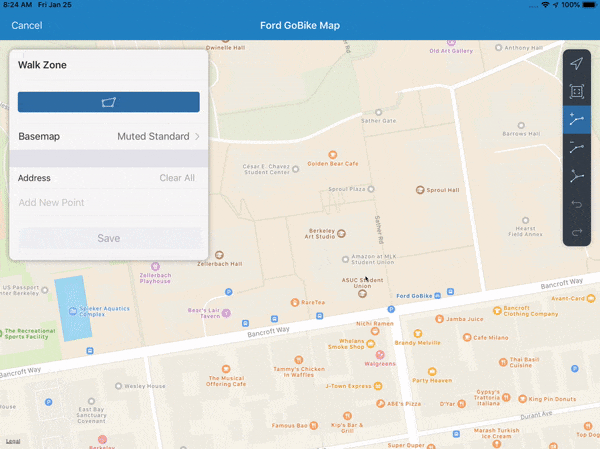

It is difficult to see exactly what area we are drawing over because of the base map.  Change the base map in the panel to `Satellite`

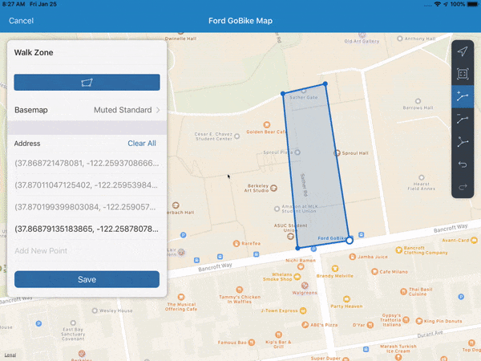

With the basemap change, we can change the `colorScheme` of the map to show lines that appear better on this background.

From the map we can see the high density of students around campus.  Let's extend the points north from Sather Gate to University Drive.  Press and hold the point then begin dragging to reposition the coordinate to University Drive

Now that we have finished creating the Walk Zone, we tap the Save Button at the bottom of the panel to perform additional post processing.  The tableView can be populated with custom fields provided by the developer.  In this example we show the `FUIMapSnapshotFormCell` which shows the added geometry in a `UITableViewCell`.  Tap Save in the right corner and the polygon will be saved to the map.

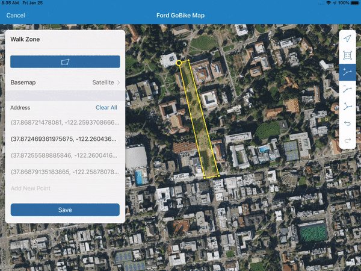

### Bike Path Polylines

Below, I'll walk through how to draw the bike path.

To get around this walk zone and to get to the center of campus, we can draw a preferred bike route that avoids too much foot traffic.  Again open the `+` to show the create options. Tap on the `Bike Path` cell to begin creating a bike path.

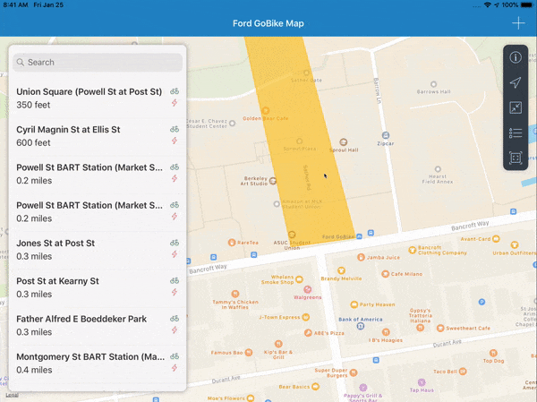

Coming from the Telegraph and Bancroft Intersection, I might take this path.  Again we tap on the map to add points.  Below is a rough path.

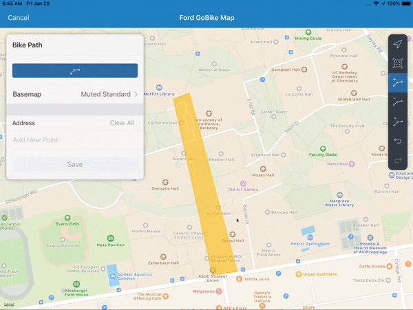

Going straight through Memorial Glade to Moffit Library can be difficult since it's practically all grass with many students around.  We can tap the Undo Button on the toolbar to undo the added points.

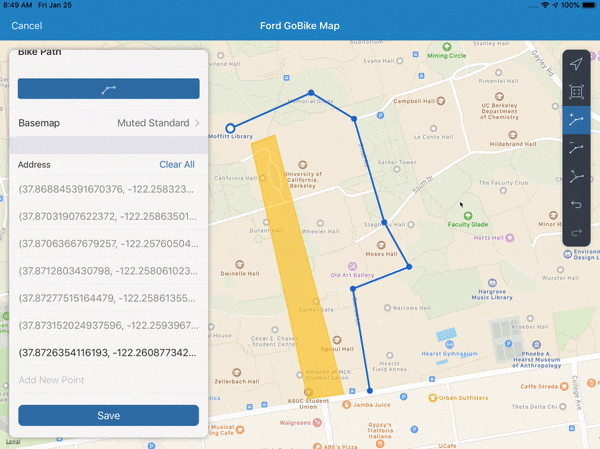

If we wanted to add back our points, we can use the Redo button.

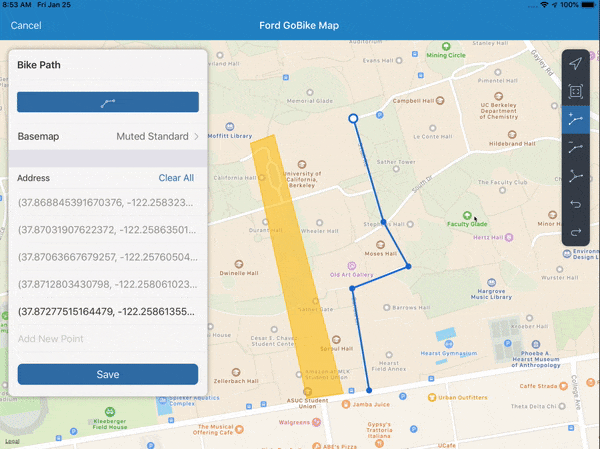

To delete a point we can toggle the Delete button and tap the point on the map.  Set the Delete button on. Then tap a point.

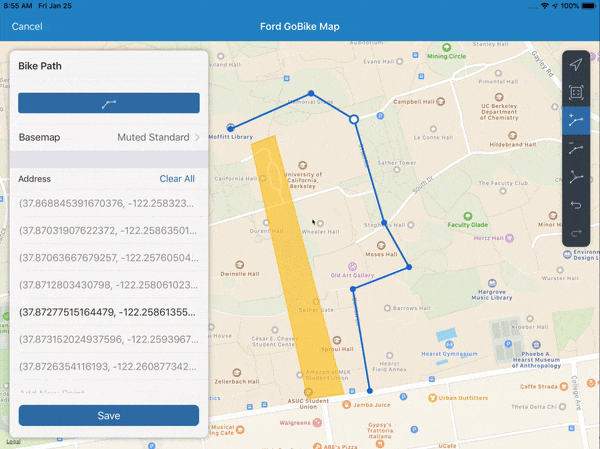

We can also swipe to delete on the editing panel.

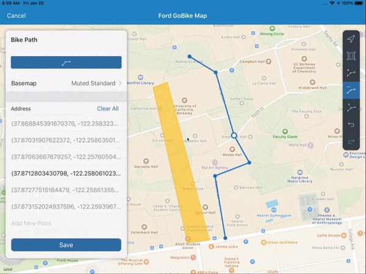

Another path I take branches out from this route.  By tapping the Branch button in the toolbar we can add a branch off of the path.

First, we toggle the Branch button to on. Next, we tap to another point on the map to continue adding points.

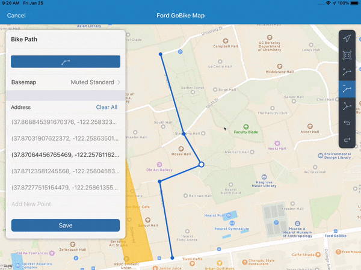

Finally, we can save our path by tapping Save to perform additional post processing.  Tapping Save in the top right, the path is now added to the map.

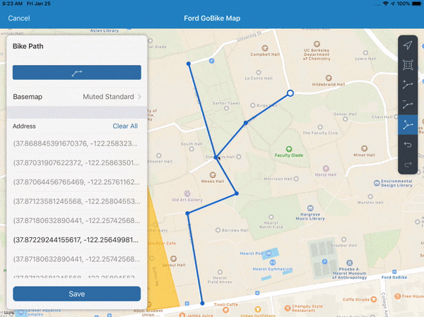

### Brewery Points

After biking around campus, we could get a refreshing beer at a local brewery.

Below, I'll walk through drawing the brewery.

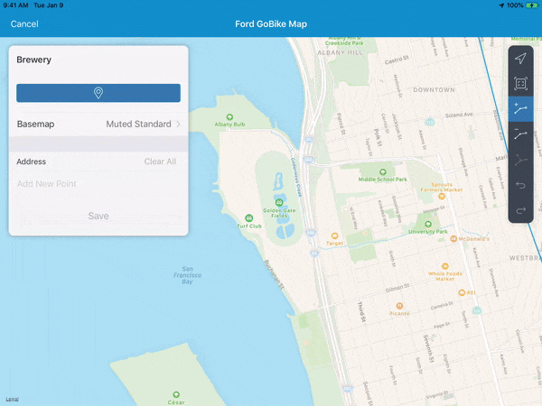

Again open the `+` to show the create options.  Tap on the `Brewery` cell to begin creating a brewery point.

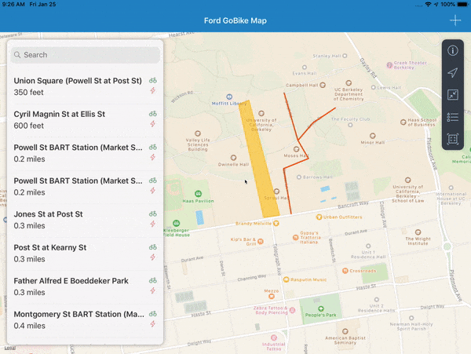

We can type directly into the cell to search for the location.  Tap on the `Add New Point` cell to open the suggestions. Begin typing `FieldWork` to show search results. Tap on `Fieldwork Brewing Company` and the point will be added.

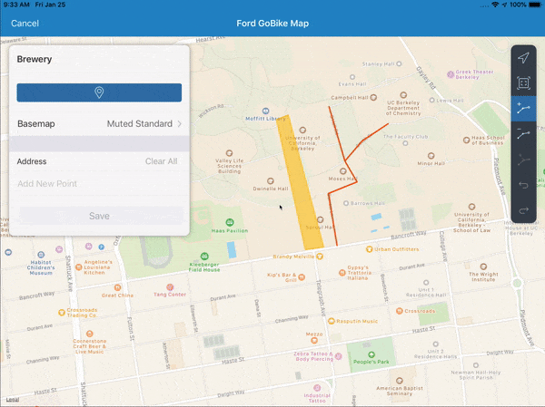

Tap Save to show post processing.  Tap Save to add the point to the map.

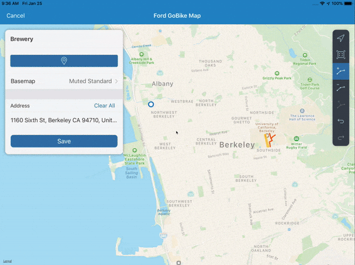

### Venue Geospatial Items

After spending the day in Berkeley, you decide to schedule a biking event.  Again open the `+` to show the create options. Tap on the `Venue` cell to begin creating a venue item.

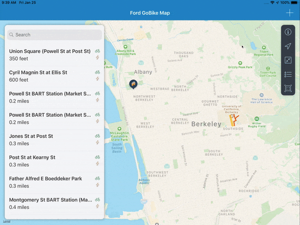

Toggle the geospatial segmented control to polygon to begin drawing a polygon.

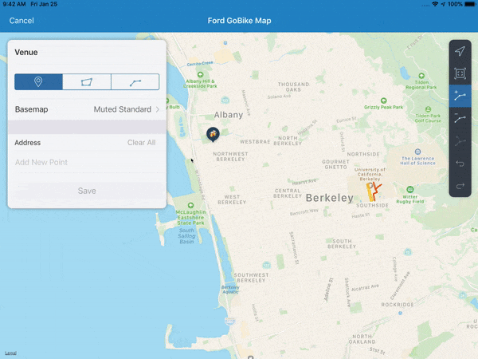

Instead of drawing a polygon, we can switch the geometry type while editing.  Toggle the geospatial segmented control to polyline.  An alert will be presented.

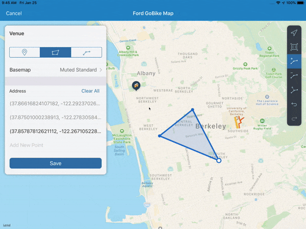

We can change the order of the points by using drag and drop on the panel.  Switch the point order by dragging the second cell above the first.

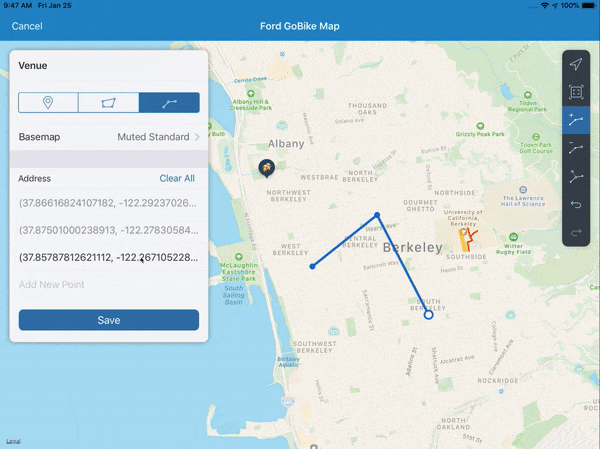

Save as usual and the map will show the Venue Item.

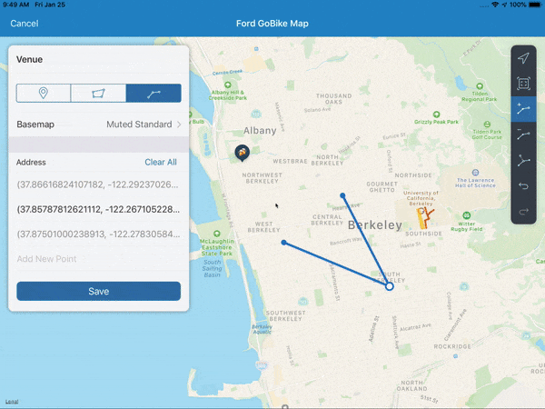

Finally we can toggle the Bike and Bart layers to see the final product.  Now we can see the station annotations, BART Line, and all of our custom geospatial items.

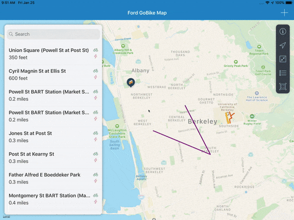

## Next Steps

Although this is the last post for this series, in the next post I will extend this project to show BART as an `FUIRoute`.

The completed project can be found [HERE](https://github.com/alextakahashi/SAPFioriBikes)

## Conclusion

The Map Floorplan component provides the foundation to create complex map applications.  Throughout this blog post series, I've documented:

* Map Floorplan Layers
* Map Legend
* Map Detail Panel
* Polylines and Polygons with StellarJay
* Drawing Geospatial Objects

I hope you learned more about SAPFiori iOS SDK's `FUIMapFloorplan`, and look forward to integrating this map feature into your next project!
