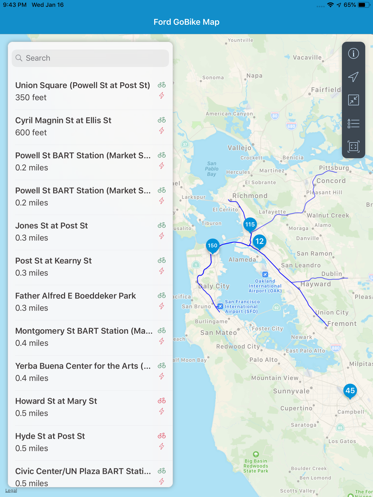
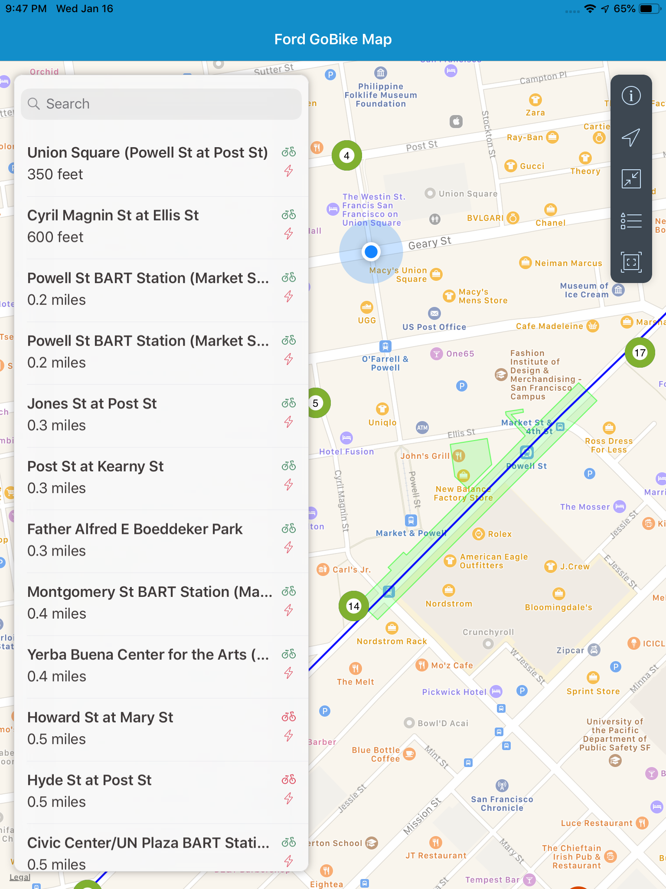
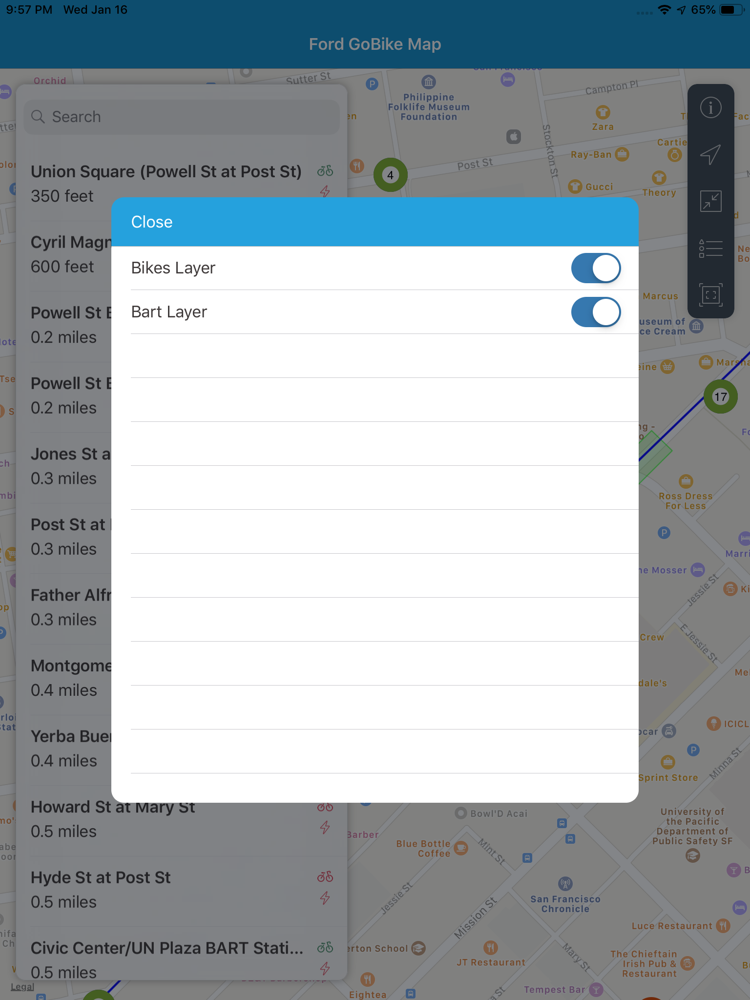
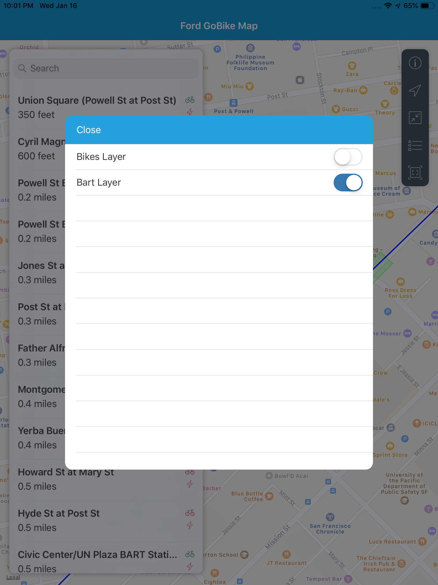
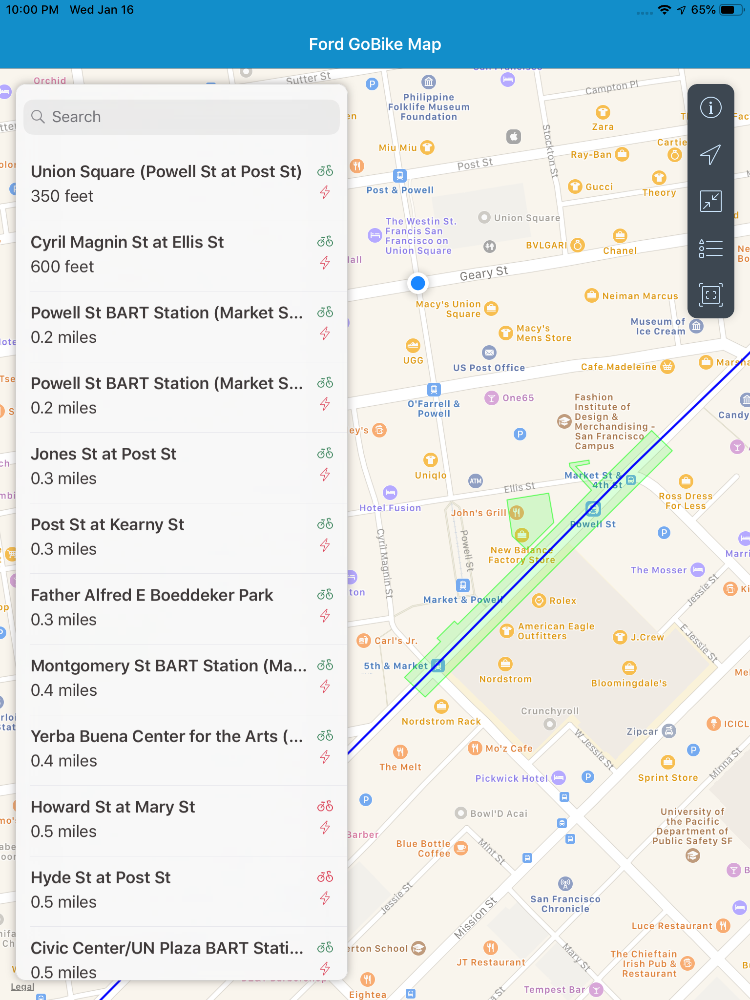
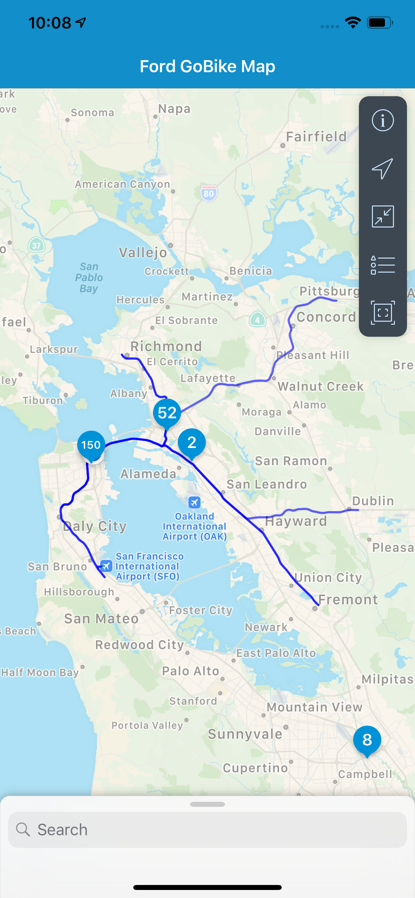
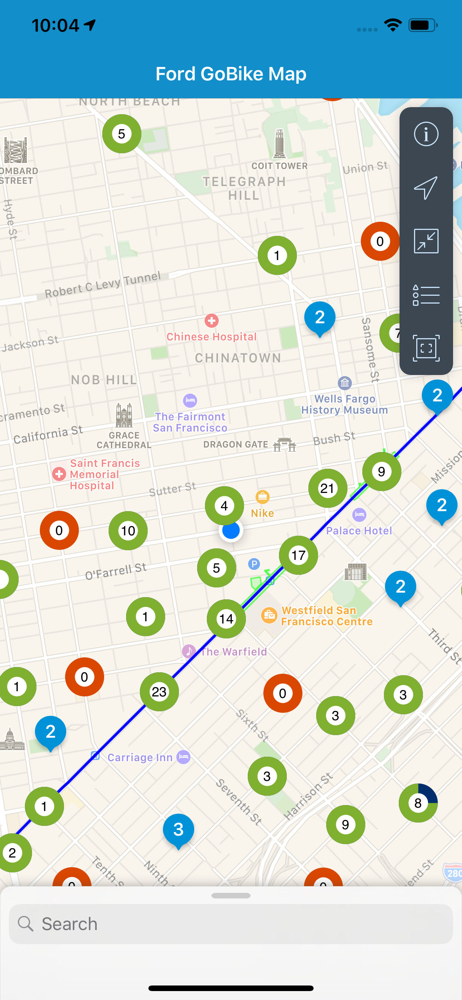
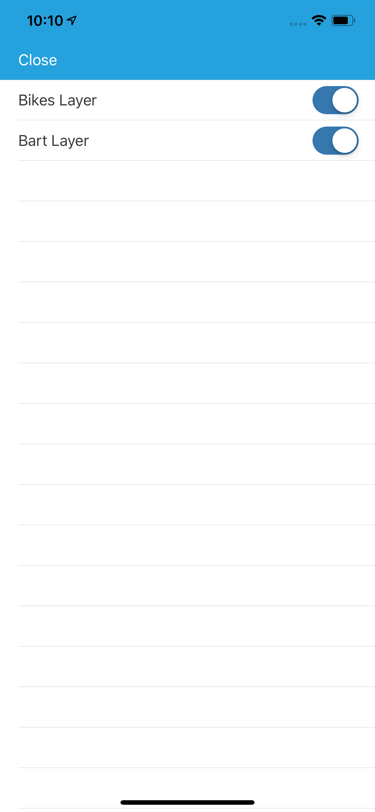
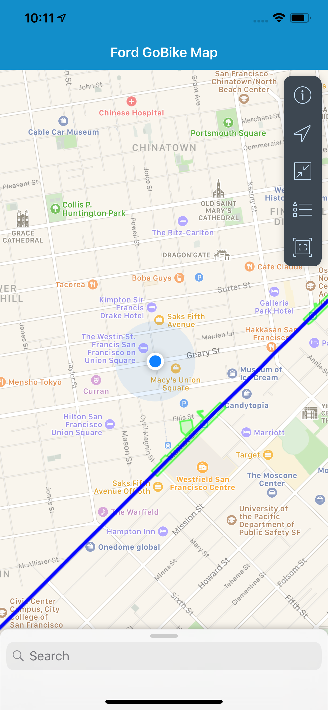

# SAPFioriBikes: Geospatial Objects with SAP CP SDK for iOS

This project follows up with the original [SAPFioriBikes Blog Series](https://blogs.sap.com/2019/01/31/sapfioribikes-visualization-of-gobike-stations-built-with-the-sap-ios-sdk/) by adding additional Geospatial Objects.

> Extending the SAPFioriBikes project by adding Geospatial Objects using [StellarJay](https://github.com/sstadelman/stellarjay). Check out the code [HERE](https://github.com/alextakahashi/SAPFioriBikes/tree/post3)

## Rich Maps using `MKPolyline` and `MKPolygon`

BART is essential for Bay Area commuters.  For many GoBike users, bikes help us go the final stretch to where we want to be.  It would be helpful to find how close we are to BART if we bike the city.  So far we have added only individual locations, but there is more to maps than just adding points.  We can add `MKPolyline`s and `MKPolygon`s to show lines and areas.  In this example, I extend [Uber Common BART GeoJSON](https://github.com/uber-common/deck.gl-data/blob/master/website/bart.geo.json) to show the BART lines as `MKPolyline`s and the stations themselves as `MKPolygon`s.

## Parsing GeoJSON with StellarJay

GeoJSON is a standard for formatting GeoSpatial Objects (`Point`, `LineString`, `Polygon`, `MultiPoint`, `MultiLineString`, and `MultiPolygon`).  Manually decoding the GeoJSON proved to be challenging with quite a few corner cases.  Thankfully, an open source framework called [StellarJay](https://github.com/sstadelman/stellarjay) converts the objects for us into overlays we can add directly to our map.  

See the `loadBartData()` method in `MapModel.swift` plus use the StellarJay playground for implementation.  When populating the `_bartLineModel`, we add the polygons and polylines as `FUIOverlay`. At the end of the function, call `reloadData()` to reload the floorplan. Additionally, we have updated the `FUIMKMapViewDataSource` to handle the BART layer.

The polyline and polygon should render on the map as follows:

## Filtering Layers

By adding additional Geospatial objects we might end up with the same problem of an overcrowded space on our map.  Using the Floorplan layer structure, it is easy to selectively filter annotations.  Tap on the Settings button at the top of the toolbar to configure the map.  The `settingsController` is a `UIViewController` launched on tap and allows the developer to supply custom configurations not supplied by the floorplan.

I've added two `FUISwitchFormCell`s that can toggle the layers ON and OFF.  If we already have a bike, we won't need to see all the stations, let's toggle the Bikes Layer.

Now the bikes are removed from view and we can clearly see how far away we are from BART!

## iPhone Support

Below are similar images taken from the XSMax.

## Next Steps

In the next post, I will show the editing function of the floorplan by drawing directly on the map.  A user will be able to draw and edit points, lines, and polygons.  The floorplan has a rich drawing feature to draw complex shapes.

Read the next blog post [HERE](https://blogs.sap.com/2019/01/31/sapfioribikes-drawing-geospatial-items/)

The completed project can be found [HERE](https://github.com/alextakahashi/SAPFioriBikes)

## Conclusion

The Map Floorplan shows not only point locations but also polylines and polygons.  A developer updates his layer model with these shapes to create richer maps.  Using the open source framework StellarJay, we can easily import GeoJSON directly into the map.  Layers are easily filterable using the Settings button to show relevant information.
