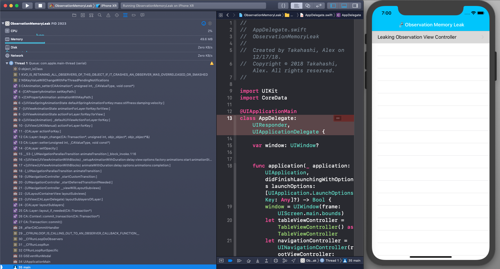
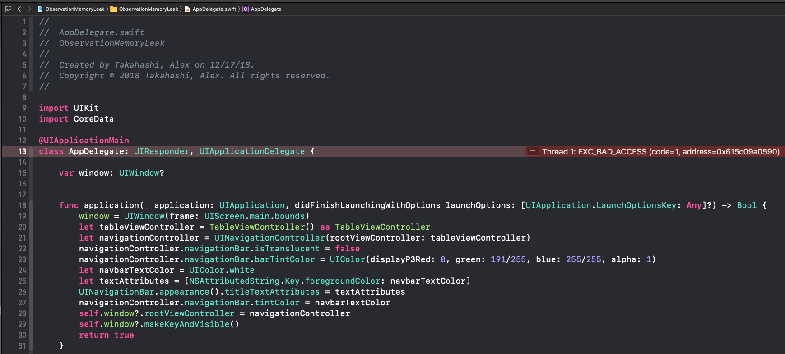

# Swift 4 KVO Memory Leak: Layer Observation + Instruments Allocations Walkthrough

The observation pattern is a necessity for any iOS developer. Managing common tasks such as orientation or keyboard launch is accessed by observing events happening under the hood of the device. [Swift 4 KVO](https://developer.apple.com/documentation/swift/cocoa_design_patterns/using_key-value_observing_in_swift) API definitely cleans up the older Swift 3 version, but the new pattern still has its caveats and gotchas. In this blog post, I'll show a memory leak discovery I've found that was particularly tough to track down.  I'll be stepping through how this leak was discovered and how to track it down using Instrument's [Allocations](https://help.apple.com/instruments/mac/current/#/dev7b8f6eb6).  Long story short, be careful of your layer bounds observation! Hopefully this will save you some hours trying to debug!



Clone the project **[[HERE]()]** to follow along.

## Crashing the apple

Let's crash the app to see what error we get.

1. Tap the Leaking Observation View Controller Cell to push the controller with the leaking view.
2. Pop the view controller by pressing the back arrow
3. Repeat until the crash appears. (Took me ~7 cycles)

## KVO Error Message

Looks like we have a `Thread1: Exec_Bad_Access` error.  Unfortunately, not very helpful.



Let's look at the thread stack trace for anything that could be useful.


The log gives us an interesting error: `KVO_IS_RETAINING_ALL_OBSERVERS_OF_THIS_OBJECT_IF_IT_CRASHES_AN_OBSERVER_WAS_OVERRELEASED_OR_SMASHED`.

At this point I knew to look for some retained observations.

## Leaking Code

Diving into the code, this project is practically just a `UITableViewController` that pushes a `UIViewController` with some view that is observed.  See `TableViewController.swift`, `ViewController.swift` for the setup if you're curious.

See `ObservingView.swift` for the leaking view.  The `LeakingObservingView` is just a `UIView` with an observation on the `layer.bounds`.  The observation is set in the `setup` method on `init`.

```
// ❌ Causes Crash!
observation = self.observe(\.layer.bounds) { (observed, _) in
    print("💧 Leaking observed!")
}
```

Let's sanity check to make sure the view is leaking.

## Allocations: Finding the Crash

First open the Instruments Window.


Choose Allocations


Prepare to record with Allocations by making sure the device is set to the `ObservationMemoryLeak` project.


Tap the red record button and start pushing and popping the Leaking View Controller.  Continue until the app crashes.  Unfortunately, Allocations shows us everything that gets allocated.  We will filter the results down.


In the `Instrument Detail` search bar at the lower left, lets filter on the keyword `Leaking` since that was the view we suspected was having the memory leak.


Click arrow next when hovering over the `ObservationMemoryLeak.LeakingObservingView` and look at the trace that is given to the right.


From the trace, the problem is coming from `LeakingObservingView.allocating_init`.  Double click that row to see the code that's causing the issue.  Code is not highlighted for us so we cannot exactly pin point the issue.


Return to the stack trace by going back a layer in Allocations click `ObservationMemoryLeak.LeakingObservingView` in the navigation stack (`Allocations` > `Statistics` > `Allocation Summary` > ...).

Click the row `ViewController.setup()` to open the code.  Luckily, code is highlighted for us.


The green line shows us the issue is happening here.

## Fixing the Crash : Safe Layer Bounds Observation

Through trial and error, I found that the safe way of watching the layer's bounds is the following:

```
// 👍 Safe Observation
observation = self.layer.observe(\.bounds) { (observed, _) in
    print("✅ Safe Observation")
}
```

Swift 4 KVO is supposed to take the hassle out of removing observers, but unfortunately this observation stuck around causing our crash.  I am not 100% sure why this happens and why chaining variables in the observe causes this crash, but it is probably some ARC reference count issue at the surface.

To see the fix, change the boolean value in the `ObservingView.swift`

```
// FIXME: Change the boolean to change the observation
private var isLeakingObservation = false
```

Run the app again push / pop the view controller and you will notice there is no crash.  If you're curious you can run Allocations again.


## Conclusion
Memory leak bugs can be tough to resolve.  Despite Swift 4 updating its KVO implementation to increase quality of life, there are still gotchas that can slip up any developer.  I hope you learned a bit about Swift 4 KVO and Allocations to save you time debugging your applications!
