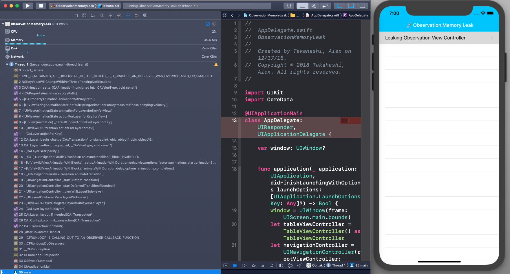

# Swift 4 KVO Memory Leak



A project to show a memory leak issue when observing the layer bounds of a view.  

Instead of observing the layer bounds as below:

```
// ❌ Causes Crash!
observation = self.observe(\.layer.bounds) { (observed, _) in
    print("💧 Leaking observed!")
}
```

Observing the layer bounds should be observed like:

```
// 👍 Safe Observation
observation = self.layer.observe(\.bounds) { (observed, _) in
    print("✅ Safe Observation")
}
```

## Getting Started

1. Clone the repository
2. Build and Run 🚰
3. Read my walkthrough [blogpost](Blogpost.md)

### Prerequisites

* Xcode 10.0+

## Authors

* **Alex Takahashi** - *Initial work* - [alexTakahashi](https://github.com/alextakahashi)

## Acknowledgments

* [README-Template](https://gist.github.com/PurpleBooth/109311bb0361f32d87a2)
